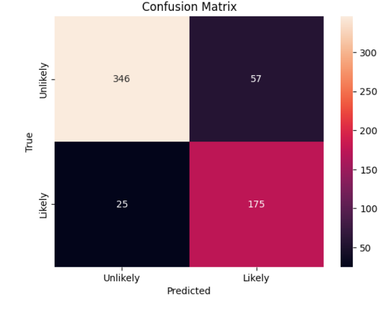

# Pet Adoption Likelihood Predictor 🐾

## 📖 Project Overview
This project builds a machine learning model to predict whether a pet is likely to be adopted based on various physical characteristics and shelter information. By analyzing factors such as breed, age, size, and vaccination status, the model helps shelters understand adoption trends and optimize their strategies.

The project implements a full data science pipeline, from exploratory data analysis (EDA) to model tuning, achieving a final accuracy of **91%** using a Decision Tree Classifier.

## 📊 Dataset
The dataset (`pet_adoption_data.csv`) contains information on 2,007 pets with 13 distinct features.

* **Target Variable:** `adoption_likelihood` (0 = Unlikely, 1 = Likely)
* **Key Features:**
    * **Physical:** `pet_type`, `breed`, `color`, `size`, `weight_kg`
    * **Health:** `vaccinated`, `health_condition` (Healthy/Medical condition)
    * **Shelter info:** `timein_shelter_days`, `adoption_fee`
    * **History:** `previous_owner`

## 🛠️ Project Workflow

### 1. Data Exploration (EDA)
* Loaded and inspected the dataset structure.
* Visualized the target distribution (`adoption_likelihood`) to check for class balance.
* Analyzed numerical distributions for `age_months` and `adoption_fee`.

### 2. Data Preprocessing
* **Encoding:**
    * Mapped ordinal feature `size` to numerical values (Small=1, Medium=2, Large=3).
    * Applied One-Hot Encoding to categorical variables: `color`, `pet_type`, `breed`.
* **Scaling:**
